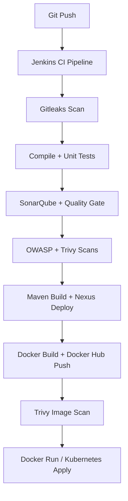

# 🛒 Spring Boot Shopping-Cart Web App - Enterprise DevSecOps Project


## 🛠 **DevSecOps Pipeline for Java-based Application (`Shopping-Cart`)**
- Designed and implemented an end-to-end **DevSecOps CI/CD pipeline** in Jenkins for a Spring Boot application, integrating stages from SCM to Kubernetes deployment.
- Embedded **security-first practices** using tools like **Gitleaks**, **Trivy**, and **OWASP Dependency-Check** to ensure vulnerability-free code, dependencies, and container images.
- Automated **SonarQube static code analysis** with Quality Gates enforcement to block deployments on code smell or low maintainability ratings.
- Built and published versioned Docker images to **Docker Hub**, with artifact deployment to **Nexus Repository**, ensuring traceability and immutability.
- Deployed the application to **Kubernetes** using dynamically templated manifests and `envsubst`, reflecting best practices in GitOps-style delivery.


---


This is a **full-lifecycle DevSecOps pipeline** for a Java-based microservice called `Shopping-Cart`. It demonstrates enterprise-grade implementation of **Secure CI/CD** using modern tools and practices. Built and orchestrated using **Jenkins**, the pipeline covers every stage from code checkout, static analysis, secrets scanning, dependency validation, image security, containerization, and Kubernetes deployment.

---

## 🚀 Tech Stack & Tooling

| Area               | Tool/Tech                                 |
|--------------------|-------------------------------------------|
| Language           | Java 17 (Spring Boot)                     |
| Build Tool         | Maven                                     |
| Source Control     | GitHub                                    |
| CI/CD Orchestrator | Jenkins (Declarative Pipeline)            |
| Static Code Scan   | SonarQube + Quality Gates                 |
| Secrets Scanning   | Gitleaks                                  |
| Dependency Audit   | OWASP Dependency-Check                    |
| Containerization   | Docker                                    |
| Image Scanning     | Trivy                                     |
| Artifact Repo      | Nexus Repository Manager                  |
| Registry           | Docker Hub                                |
| Kubernetes         | kubectl + K8s YAML manifests (Helm optional) |

---

## ✅ Pipeline Stages Explained

### 🔹 1. Clean Workspace
Cleans previous workspace and local cache to avoid stale data.

### 🔹 2. Git Checkout
Clones the `main` branch from GitHub repo securely.

### 🔹 3. Gitleaks Secret Scan
Scans codebase for API keys, tokens, credentials before any build begins (shift-left security).

### 🔹 4. Compilation
Compiles code without running tests to speed up pipeline feedback loop.

### 🔹 5. Unit Testing
Runs JUnit tests. Can be extended to integrate with Jacoco/Surefire for coverage metrics.

### 🔹 6. TRIVY FS Scan
Performs filesystem scan of the source repo using Trivy to detect CVEs before build.

### 🔹 7. SonarQube Code Quality Scan
Runs full static analysis and enforces **Quality Gates**. Pipeline blocks on failure.

### 🔹 8. Build Application Artifact
Builds versioned JARs using `maven versions:set` for proper artifact traceability.

### 🔹 9. Publish to Nexus
Publishes signed and versioned artifacts to **Nexus** repository manager.

### 🔹 10. OWASP Dependency Check
Audits all Java dependencies for known vulnerabilities with CVSS scoring.

### 🔹 11. Docker Build & Push
Builds image using Alpine JDK base and pushes securely to Docker Hub with token auth.

### 🔹 12. Trivy Image Scan
Scans Docker image layers for vulnerabilities, licenses, and misconfigurations.

### 🔹 13. Docker Container Deployment
Deploys application on a Docker host using `--restart unless-stopped` and port binding.

### 🔹 14. Kubernetes Deployment
Uses templated YAML and `envsubst` to inject image tags dynamically. Applies config via `kubectl apply`.

---

## 🛡️ Security Best Practices

- **Secrets Detection (Gitleaks)** before any build or deployment
- **Quality Gate Enforcement** via SonarQube
- **SBOM & CVE Scan** via OWASP Dependency Check + Trivy
- **Docker Hardening** using Alpine base image and resource-limited containers
- **Immutable Artifacts** versioned and published to Nexus

---

## 📁 Folder Structure

```
.
├── Jenkinsfile
├── Dockerfile
├── deployment.template.yaml
├── pom.xml
├── src/
│   └── main/java/com/example/cart
├── trivy-image-scan.txt
└── trivyfs.txt
```

---

## 🔄 CI/CD Flow Diagram (Simplified)



---

## 🎯 Highlights

- ✅ End-to-end **DevSecOps pipeline**
- ✅ Fully automated with versioned artifacts and images
- ✅ Enforces **security gates and auditability**
- ✅ Kubernetes-ready, CI/CD-driven delivery
- ✅ Global best practices followed for container lifecycle

---

## 👨‍💼 About Me

This project is authored and maintained by **Nahid**, a Aspiring DevOps & Cloud Engineer with a vision to contribute globally to scalable, secure, and reliable software delivery.

> **Aspiring for global DevOps leadership roles** with proven hands-on expertise in building production-grade DevSecOps pipelines.

---

## 📬 Contact & Social

- [LinkedIn](https://www.linkedin.com/in/nahid099/)
- [Email](mailto:nahidkishore99@gmail.com)
- [Docker Hub](https://hub.docker.com/u/nahid0002)

---

## 📝 License

This project is open-sourced for educational and professional reference use.

---


## About

This is a demo project for practicing Spring + Thymeleaf. The idea was to build some basic shopping cart web app.

It was made using **Spring Boot**, **Spring Security**, **Thymeleaf**, **Spring Data JPA**, **Spring Data REST and Docker**. 
Database is in memory **H2**.

There is a login and registration functionality included.

Users can shop for products. Each user has his own shopping cart (session functionality).
Checkout is transactional.

## Configuration

### Configuration Files

Folder **src/resources/** contains config files for **shopping-cart** Spring Boot application.

* **src/resources/application.properties** - main configuration file. Here it is possible to change admin username/password,
as well as change the port number.

## How to run

There are several ways to run the application. You can run it from the command line with included Maven Wrapper, Maven or Docker. 

Once the app starts, go to the web browser and visit `http://localhost:8070/home`

Admin username: **admin**

Admin password: **admin**

User username: **user**

User password: **password**

### Maven Wrapper

#### Using the Maven Plugin

Go to the root folder of the application and type:
```bash
$ chmod +x scripts/mvnw
$ scripts/mvnw spring-boot:run
```

#### Using Executable Jar

Or you can build the JAR file with 
```bash
$ scripts/mvnw clean package
``` 

Then you can run the JAR file:
```bash
$ java -jar target/shopping-cart-0.0.1-SNAPSHOT.jar
```

### Maven

Open a terminal and run the following commands to ensure that you have valid versions of Java and Maven installed:

```bash
$ java -version
java version "1.8.0_102"
Java(TM) SE Runtime Environment (build 1.8.0_102-b14)
Java HotSpot(TM) 64-Bit Server VM (build 25.102-b14, mixed mode)
```

```bash
$ mvn -v
Apache Maven 3.3.9 (bb52d8502b132ec0a5a3f4c09453c07478323dc5; 2015-11-10T16:41:47+00:00)
Maven home: /usr/local/Cellar/maven/3.3.9/libexec
Java version: 1.8.0_102, vendor: Oracle Corporation
```

#### Using the Maven Plugin

The Spring Boot Maven plugin includes a run goal that can be used to quickly compile and run your application. 
Applications run in an exploded form, as they do in your IDE. 
The following example shows a typical Maven command to run a Spring Boot application:
 
```bash
$ mvn spring-boot:run
``` 

#### Using Executable Jar

To create an executable jar run:

```bash
$ mvn clean package
``` 

To run that application, use the java -jar command, as follows:

```bash
$ java -jar target/shopping-cart-0.0.1-SNAPSHOT.jar
```

To exit the application, press **ctrl-c**.

### Docker

It is possible to run **shopping-cart** using Docker:

Build Docker image:
```bash
$ mvn clean package
$ docker build -t shopping-cart:dev -f docker/Dockerfile .
```

Run Docker container:
```bash
$ docker run --rm -i -p 8070:8070 \
      --name shopping-cart \
      shopping-cart:dev
```

##### Helper script

It is possible to run all of the above with helper script:

```bash
$ chmod +x scripts/run_docker.sh
$ scripts/run_docker.sh
```
